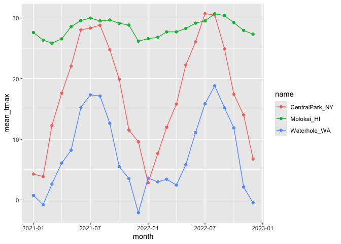

Exploratory Data Analysis
================
2024-10-03

All of the looking at the data, poking at it between importing and
analysis Includes: visualisation, checks hypothesis generating
(sometimes), mostly about getting a sense of the data before getting
started

Group level summaries today: May want to do examine groups visually and
quantitatively (can do numeric summaries today) Computing a mean,
median, sd, missingness in a group

Unless makes the group explicit it doesn’t exist especially after you
start mutating it etc. group_by makes the grouping that we care about in
the dataset explicit so that when we use other things in tidyverse they
are aware of it.

``` r
weather_df = 
  rnoaa::meteo_pull_monitors(
    c("USW00094728", "USW00022534", "USS0023B17S"),
    var = c("PRCP", "TMIN", "TMAX"), 
    date_min = "2021-01-01",
    date_max = "2022-12-31") |>
  mutate(
    name = case_match(
      id, 
      "USW00094728" ~ "CentralPark_NY", 
      "USW00022534" ~ "Molokai_HI",
      "USS0023B17S" ~ "Waterhole_WA"),
    tmin = tmin / 10,
    tmax = tmax / 10,
    month = lubridate::floor_date(date, unit = "month")) |>
  select(name, id, everything())
```

    ## using cached file: /Users/florapang/Library/Caches/org.R-project.R/R/rnoaa/noaa_ghcnd/USW00094728.dly

    ## date created (size, mb): 2024-09-26 10:19:28.845047 (8.651)

    ## file min/max dates: 1869-01-01 / 2024-09-30

    ## using cached file: /Users/florapang/Library/Caches/org.R-project.R/R/rnoaa/noaa_ghcnd/USW00022534.dly

    ## date created (size, mb): 2024-09-26 10:19:37.122774 (3.932)

    ## file min/max dates: 1949-10-01 / 2024-09-30

    ## using cached file: /Users/florapang/Library/Caches/org.R-project.R/R/rnoaa/noaa_ghcnd/USS0023B17S.dly

    ## date created (size, mb): 2024-09-26 10:19:39.66549 (1.036)

    ## file min/max dates: 1999-09-01 / 2024-09-30

lubridate to use data and time variables (floor_date can round down,
here to the first of the month)

Let’s make some plots

``` r
weather_df %>% 
  ggplot(aes(x = prcp)) + 
  geom_histogram()
```

    ## `stat_bin()` using `bins = 30`. Pick better value with `binwidth`.

    ## Warning: Removed 15 rows containing non-finite outside the scale range
    ## (`stat_bin()`).

<!-- -->

``` r
weather_df %>% 
  filter(prcp > 1000)
```

    ## # A tibble: 3 × 7
    ##   name           id          date        prcp  tmax  tmin month     
    ##   <chr>          <chr>       <date>     <dbl> <dbl> <dbl> <date>    
    ## 1 CentralPark_NY USW00094728 2021-08-21  1130  27.8  22.8 2021-08-01
    ## 2 CentralPark_NY USW00094728 2021-09-01  1811  25.6  17.2 2021-09-01
    ## 3 Molokai_HI     USW00022534 2022-12-18  1120  23.3  18.9 2022-12-01

Taking a look at stuff and trying to understand what is going on

``` r
weather_df %>%
  filter(tmax > 20, tmax < 30) %>% 
  ggplot(aes(x = tmin, y = tmax, color = name, shape = name)) +
  geom_point()
```

<!-- -->

something is weird since Central park and Molokai are recording data
differently since their data points are appearing in bands where as
Waterhole are more scattered

\##group_by()

``` r
weather_df %>% 
  group_by(name)
```

    ## # A tibble: 2,190 × 7
    ## # Groups:   name [3]
    ##    name           id          date        prcp  tmax  tmin month     
    ##    <chr>          <chr>       <date>     <dbl> <dbl> <dbl> <date>    
    ##  1 CentralPark_NY USW00094728 2021-01-01   157   4.4   0.6 2021-01-01
    ##  2 CentralPark_NY USW00094728 2021-01-02    13  10.6   2.2 2021-01-01
    ##  3 CentralPark_NY USW00094728 2021-01-03    56   3.3   1.1 2021-01-01
    ##  4 CentralPark_NY USW00094728 2021-01-04     5   6.1   1.7 2021-01-01
    ##  5 CentralPark_NY USW00094728 2021-01-05     0   5.6   2.2 2021-01-01
    ##  6 CentralPark_NY USW00094728 2021-01-06     0   5     1.1 2021-01-01
    ##  7 CentralPark_NY USW00094728 2021-01-07     0   5    -1   2021-01-01
    ##  8 CentralPark_NY USW00094728 2021-01-08     0   2.8  -2.7 2021-01-01
    ##  9 CentralPark_NY USW00094728 2021-01-09     0   2.8  -4.3 2021-01-01
    ## 10 CentralPark_NY USW00094728 2021-01-10     0   5    -1.6 2021-01-01
    ## # ℹ 2,180 more rows

``` r
weather_df %>% 
  group_by(month)
```

    ## # A tibble: 2,190 × 7
    ## # Groups:   month [24]
    ##    name           id          date        prcp  tmax  tmin month     
    ##    <chr>          <chr>       <date>     <dbl> <dbl> <dbl> <date>    
    ##  1 CentralPark_NY USW00094728 2021-01-01   157   4.4   0.6 2021-01-01
    ##  2 CentralPark_NY USW00094728 2021-01-02    13  10.6   2.2 2021-01-01
    ##  3 CentralPark_NY USW00094728 2021-01-03    56   3.3   1.1 2021-01-01
    ##  4 CentralPark_NY USW00094728 2021-01-04     5   6.1   1.7 2021-01-01
    ##  5 CentralPark_NY USW00094728 2021-01-05     0   5.6   2.2 2021-01-01
    ##  6 CentralPark_NY USW00094728 2021-01-06     0   5     1.1 2021-01-01
    ##  7 CentralPark_NY USW00094728 2021-01-07     0   5    -1   2021-01-01
    ##  8 CentralPark_NY USW00094728 2021-01-08     0   2.8  -2.7 2021-01-01
    ##  9 CentralPark_NY USW00094728 2021-01-09     0   2.8  -4.3 2021-01-01
    ## 10 CentralPark_NY USW00094728 2021-01-10     0   5    -1.6 2021-01-01
    ## # ℹ 2,180 more rows

Not modifying the dataset, but adding a layer ontop for useful
subsequent things

``` r
weather_df %>% 
  group_by(name) %>% 
  summarise(n_obs = n())
```

    ## # A tibble: 3 × 2
    ##   name           n_obs
    ##   <chr>          <int>
    ## 1 CentralPark_NY   730
    ## 2 Molokai_HI       730
    ## 3 Waterhole_WA     730

``` r
weather_df %>% 
  group_by(month) %>% 
  summarise(n_obs = n())
```

    ## # A tibble: 24 × 2
    ##    month      n_obs
    ##    <date>     <int>
    ##  1 2021-01-01    93
    ##  2 2021-02-01    84
    ##  3 2021-03-01    93
    ##  4 2021-04-01    90
    ##  5 2021-05-01    93
    ##  6 2021-06-01    90
    ##  7 2021-07-01    93
    ##  8 2021-08-01    93
    ##  9 2021-09-01    90
    ## 10 2021-10-01    93
    ## # ℹ 14 more rows

the number of distinct observations

``` r
weather_df %>% 
  group_by(month) %>% 
  summarise(
    n_obs = n(),
    n_dist = n_distinct(month))
```

    ## # A tibble: 24 × 3
    ##    month      n_obs n_dist
    ##    <date>     <int>  <int>
    ##  1 2021-01-01    93      1
    ##  2 2021-02-01    84      1
    ##  3 2021-03-01    93      1
    ##  4 2021-04-01    90      1
    ##  5 2021-05-01    93      1
    ##  6 2021-06-01    90      1
    ##  7 2021-07-01    93      1
    ##  8 2021-08-01    93      1
    ##  9 2021-09-01    90      1
    ## 10 2021-10-01    93      1
    ## # ℹ 14 more rows

``` r
weather_df %>% 
  group_by(name, month) %>% 
  summarise(
    n_obs = n())
```

    ## `summarise()` has grouped output by 'name'. You can override using the
    ## `.groups` argument.

    ## # A tibble: 72 × 3
    ## # Groups:   name [3]
    ##    name           month      n_obs
    ##    <chr>          <date>     <int>
    ##  1 CentralPark_NY 2021-01-01    31
    ##  2 CentralPark_NY 2021-02-01    28
    ##  3 CentralPark_NY 2021-03-01    31
    ##  4 CentralPark_NY 2021-04-01    30
    ##  5 CentralPark_NY 2021-05-01    31
    ##  6 CentralPark_NY 2021-06-01    30
    ##  7 CentralPark_NY 2021-07-01    31
    ##  8 CentralPark_NY 2021-08-01    31
    ##  9 CentralPark_NY 2021-09-01    30
    ## 10 CentralPark_NY 2021-10-01    31
    ## # ℹ 62 more rows

One off function that does counting

``` r
weather_df %>% 
  count(name)
```

    ## # A tibble: 3 × 2
    ##   name               n
    ##   <chr>          <int>
    ## 1 CentralPark_NY   730
    ## 2 Molokai_HI       730
    ## 3 Waterhole_WA     730

\##2x2 tables (kinda)

Binary predictor for something to look like a 2x2 table

``` r
weather_df %>% 
  drop_na(tmax) %>% 
  filter(name!= "Molokai_HI") %>% 
  mutate(
    cold = case_when(
      tmax < 5 ~ "cold", 
      tmax >= 5 ~ "not_cold"
    )
  ) %>% 
  janitor::tabyl(name, cold)
```

    ##            name cold not_cold
    ##  CentralPark_NY   96      634
    ##    Waterhole_WA  319      395

\##general numeric summaries

let’s try some other useful summaries

``` r
weather_df %>% 
  group_by(name) %>% 
  summarise(
    mean_tmax = mean(tmax, na.rm = TRUE),
    median_tmin = median(tmin, na.rm = TRUE),
    sd_prcp = sd(prcp, na.rm = TRUE)
  )
```

    ## # A tibble: 3 × 4
    ##   name           mean_tmax median_tmin sd_prcp
    ##   <chr>              <dbl>       <dbl>   <dbl>
    ## 1 CentralPark_NY     17.7         10     113. 
    ## 2 Molokai_HI         28.3         20.6    63.2
    ## 3 Waterhole_WA        7.38        -0.6   111.

After group_by it keeps those groups, be aware of it and will keep thsoe
groups as you continue to do other things

``` r
weather_df %>% 
  group_by(name, month) %>% 
  summarise(
    mean_tmax = mean(tmax, na.rm = TRUE),
    median_tmin = median(tmin, na.rm = TRUE),
    sd_prcp = sd(prcp, na.rm = TRUE)
  ) %>% 
  ggplot(aes(x = month, y = mean_tmax, color = name)) + 
  geom_point() +
  geom_line()
```

    ## `summarise()` has grouped output by 'name'. You can override using the
    ## `.groups` argument.

<!-- -->

Can be easier to see the trends if do some summary before Not looking at
all the data all at once

can print the data frames but can also format better for readers

``` r
weather_df %>% 
  group_by(name, month) %>% 
  summarise(
    mean_tmax = mean(tmax, na.rm = TRUE)
  )
```

    ## `summarise()` has grouped output by 'name'. You can override using the
    ## `.groups` argument.

    ## # A tibble: 72 × 3
    ## # Groups:   name [3]
    ##    name           month      mean_tmax
    ##    <chr>          <date>         <dbl>
    ##  1 CentralPark_NY 2021-01-01      4.27
    ##  2 CentralPark_NY 2021-02-01      3.87
    ##  3 CentralPark_NY 2021-03-01     12.3 
    ##  4 CentralPark_NY 2021-04-01     17.6 
    ##  5 CentralPark_NY 2021-05-01     22.1 
    ##  6 CentralPark_NY 2021-06-01     28.1 
    ##  7 CentralPark_NY 2021-07-01     28.4 
    ##  8 CentralPark_NY 2021-08-01     28.8 
    ##  9 CentralPark_NY 2021-09-01     24.8 
    ## 10 CentralPark_NY 2021-10-01     19.9 
    ## # ℹ 62 more rows

currently hard to read, so making something ‘untidy’ for easier
legibility

``` r
weather_df %>% 
  group_by(name, month) %>% 
  summarise(
    mean_tmax = mean(tmax, na.rm = TRUE)
  ) %>% 
  pivot_wider(
    names_from = name, 
    values_from = mean_tmax
  ) %>% 
  knitr::kable(
    digits = 3,
    col.names = c("Month", "Central Park", "Molokai", "Waterhole"))
```

    ## `summarise()` has grouped output by 'name'. You can override using the
    ## `.groups` argument.

| Month      | Central Park | Molokai | Waterhole |
|:-----------|-------------:|--------:|----------:|
| 2021-01-01 |        4.271 |  27.616 |     0.800 |
| 2021-02-01 |        3.868 |  26.368 |    -0.786 |
| 2021-03-01 |       12.294 |  25.861 |     2.623 |
| 2021-04-01 |       17.607 |  26.567 |     6.097 |
| 2021-05-01 |       22.084 |  28.577 |     8.203 |
| 2021-06-01 |       28.057 |  29.587 |    15.253 |
| 2021-07-01 |       28.352 |  29.994 |    17.335 |
| 2021-08-01 |       28.810 |  29.523 |    17.152 |
| 2021-09-01 |       24.787 |  29.673 |    12.647 |
| 2021-10-01 |       19.926 |  29.129 |     5.481 |
| 2021-11-01 |       11.537 |  28.847 |     3.533 |
| 2021-12-01 |        9.587 |  26.190 |    -2.097 |
| 2022-01-01 |        2.855 |  26.606 |     3.606 |
| 2022-02-01 |        7.650 |  26.829 |     2.989 |
| 2022-03-01 |       11.990 |  27.726 |     3.416 |
| 2022-04-01 |       15.810 |  27.723 |     2.463 |
| 2022-05-01 |       22.255 |  28.283 |     5.810 |
| 2022-06-01 |       26.090 |  29.157 |    11.127 |
| 2022-07-01 |       30.723 |  29.529 |    15.861 |
| 2022-08-01 |       30.500 |  30.697 |    18.830 |
| 2022-09-01 |       24.923 |  30.413 |    15.207 |
| 2022-10-01 |       17.426 |  29.223 |    11.884 |
| 2022-11-01 |       14.017 |  27.960 |     2.140 |
| 2022-12-01 |        6.761 |  27.348 |    -0.460 |

digits = 3, means how many numbers after the decimal point the col.names
just makes the names prettier, wihtout will just keep the origianl input
name from the name column

Computing groups and summaries are important in getting to know the
dataset

Other things that we can do ontop of the group

\##grouped mutate

``` r
weather_df %>% 
  mutate(mean_tmax = mean(tmax, na.rm = TRUE))
```

    ## # A tibble: 2,190 × 8
    ##    name           id          date        prcp  tmax  tmin month      mean_tmax
    ##    <chr>          <chr>       <date>     <dbl> <dbl> <dbl> <date>         <dbl>
    ##  1 CentralPark_NY USW00094728 2021-01-01   157   4.4   0.6 2021-01-01      17.9
    ##  2 CentralPark_NY USW00094728 2021-01-02    13  10.6   2.2 2021-01-01      17.9
    ##  3 CentralPark_NY USW00094728 2021-01-03    56   3.3   1.1 2021-01-01      17.9
    ##  4 CentralPark_NY USW00094728 2021-01-04     5   6.1   1.7 2021-01-01      17.9
    ##  5 CentralPark_NY USW00094728 2021-01-05     0   5.6   2.2 2021-01-01      17.9
    ##  6 CentralPark_NY USW00094728 2021-01-06     0   5     1.1 2021-01-01      17.9
    ##  7 CentralPark_NY USW00094728 2021-01-07     0   5    -1   2021-01-01      17.9
    ##  8 CentralPark_NY USW00094728 2021-01-08     0   2.8  -2.7 2021-01-01      17.9
    ##  9 CentralPark_NY USW00094728 2021-01-09     0   2.8  -4.3 2021-01-01      17.9
    ## 10 CentralPark_NY USW00094728 2021-01-10     0   5    -1.6 2021-01-01      17.9
    ## # ℹ 2,180 more rows

Here it does the mean tmax of all the observations But if want mean tmax
of specific places (group) then can group by Once added grouping layer,
then mutate will keep track of those groups

``` r
weather_df %>% 
  group_by(name) %>% 
  mutate(
    mean_tmax = mean(tmax, na.rm = TRUE),
    centered_tmax = tmax - mean_tmax) %>% 
  ggplot(aes(x = date, y = centered_tmax, color = name)) +
  geom_point()
```

    ## Warning: Removed 17 rows containing missing values or values outside the scale range
    ## (`geom_point()`).

<!-- -->

Centering is each done for them seperately

\##Window function

The previous example used mean() to compute the mean within each group,
which was then subtracted from the observed max tempurature. mean()
takes n inputs and produces a single output.

Window functions, in contrast, take n inputs and return n outputs, and
the outputs depend on all the inputs.

Window functions are iterative(?)

Find hottest / coldest days

``` r
weather_df %>% 
  mutate(
    temp_rank = min_rank(tmax)
  ) %>% 
  filter(temp_rank < 10)
```

    ## # A tibble: 10 × 8
    ##    name           id          date        prcp  tmax  tmin month      temp_rank
    ##    <chr>          <chr>       <date>     <dbl> <dbl> <dbl> <date>         <int>
    ##  1 CentralPark_NY USW00094728 2022-01-15     0  -6   -12.1 2022-01-01         7
    ##  2 CentralPark_NY USW00094728 2022-12-24     0  -9.3 -13.8 2022-12-01         4
    ##  3 Waterhole_WA   USS0023B17S 2021-02-11    51  -5.6 -10.9 2021-02-01         9
    ##  4 Waterhole_WA   USS0023B17S 2021-12-26   102 -11.4 -18.3 2021-12-01         1
    ##  5 Waterhole_WA   USS0023B17S 2021-12-27    25  -9.8 -19.6 2021-12-01         2
    ##  6 Waterhole_WA   USS0023B17S 2021-12-28     0  -6   -11.4 2021-12-01         7
    ##  7 Waterhole_WA   USS0023B17S 2021-12-29   102  -7.9 -15.4 2021-12-01         6
    ##  8 Waterhole_WA   USS0023B17S 2022-02-22   102  -9.3 -16.6 2022-02-01         4
    ##  9 Waterhole_WA   USS0023B17S 2022-12-18     0  -5.6 -11.3 2022-12-01         9
    ## 10 Waterhole_WA   USS0023B17S 2022-12-21     0  -9.6 -18.4 2022-12-01         3

ten of the coldest day in the dataframe

``` r
weather_df %>% 
  group_by(name) %>% 
  mutate(
    temp_rank = min_rank(tmax)
  ) %>% 
  filter(temp_rank < 4)
```

    ## # A tibble: 9 × 8
    ## # Groups:   name [3]
    ##   name           id          date        prcp  tmax  tmin month      temp_rank
    ##   <chr>          <chr>       <date>     <dbl> <dbl> <dbl> <date>         <int>
    ## 1 CentralPark_NY USW00094728 2022-01-15     0  -6   -12.1 2022-01-01         2
    ## 2 CentralPark_NY USW00094728 2022-01-21     0  -5.5  -9.9 2022-01-01         3
    ## 3 CentralPark_NY USW00094728 2022-12-24     0  -9.3 -13.8 2022-12-01         1
    ## 4 Molokai_HI     USW00022534 2021-01-18   234  22.2  19.4 2021-01-01         2
    ## 5 Molokai_HI     USW00022534 2021-03-18   142  21.7  18.9 2021-03-01         1
    ## 6 Molokai_HI     USW00022534 2022-11-28    56  22.2  20.6 2022-11-01         2
    ## 7 Waterhole_WA   USS0023B17S 2021-12-26   102 -11.4 -18.3 2021-12-01         1
    ## 8 Waterhole_WA   USS0023B17S 2021-12-27    25  -9.8 -19.6 2021-12-01         2
    ## 9 Waterhole_WA   USS0023B17S 2022-12-21     0  -9.6 -18.4 2022-12-01         3

Now getting top 3 coldest days for each name

``` r
weather_df %>% 
  group_by(name) %>% 
  mutate(
    temp_rank = min_rank(desc(tmax))
  ) %>% 
  filter(temp_rank < 4)
```

    ## # A tibble: 16 × 8
    ## # Groups:   name [3]
    ##    name           id          date        prcp  tmax  tmin month      temp_rank
    ##    <chr>          <chr>       <date>     <dbl> <dbl> <dbl> <date>         <int>
    ##  1 CentralPark_NY USW00094728 2021-06-29     0  35    25.6 2021-06-01         3
    ##  2 CentralPark_NY USW00094728 2021-06-30   165  36.7  22.8 2021-06-01         1
    ##  3 CentralPark_NY USW00094728 2022-07-20     0  35    25.6 2022-07-01         3
    ##  4 CentralPark_NY USW00094728 2022-07-23     0  35    25.6 2022-07-01         3
    ##  5 CentralPark_NY USW00094728 2022-07-24     0  35    26.1 2022-07-01         3
    ##  6 CentralPark_NY USW00094728 2022-08-09     8  36.1  25.6 2022-08-01         2
    ##  7 Molokai_HI     USW00022534 2021-05-31     0  32.2  17.2 2021-05-01         2
    ##  8 Molokai_HI     USW00022534 2021-09-16     0  32.2  21.1 2021-09-01         2
    ##  9 Molokai_HI     USW00022534 2022-07-30     0  32.2  22.2 2022-07-01         2
    ## 10 Molokai_HI     USW00022534 2022-08-06     0  33.3  20.6 2022-08-01         1
    ## 11 Molokai_HI     USW00022534 2022-08-17     0  32.2  21.1 2022-08-01         2
    ## 12 Molokai_HI     USW00022534 2022-09-24     0  32.2  22.2 2022-09-01         2
    ## 13 Molokai_HI     USW00022534 2022-09-30     0  32.2  20   2022-09-01         2
    ## 14 Waterhole_WA   USS0023B17S 2021-06-27     0  28.5  17.6 2021-06-01         3
    ## 15 Waterhole_WA   USS0023B17S 2021-06-28     0  30.8  20.7 2021-06-01         2
    ## 16 Waterhole_WA   USS0023B17S 2021-06-29     0  32.4  17.6 2021-06-01         1

``` r
weather_df %>% 
  group_by(name) %>% 
  filter(min_rank(tmax) < 4) %>% 
  arrange(tmax)
```

    ## # A tibble: 9 × 7
    ## # Groups:   name [3]
    ##   name           id          date        prcp  tmax  tmin month     
    ##   <chr>          <chr>       <date>     <dbl> <dbl> <dbl> <date>    
    ## 1 Waterhole_WA   USS0023B17S 2021-12-26   102 -11.4 -18.3 2021-12-01
    ## 2 Waterhole_WA   USS0023B17S 2021-12-27    25  -9.8 -19.6 2021-12-01
    ## 3 Waterhole_WA   USS0023B17S 2022-12-21     0  -9.6 -18.4 2022-12-01
    ## 4 CentralPark_NY USW00094728 2022-12-24     0  -9.3 -13.8 2022-12-01
    ## 5 CentralPark_NY USW00094728 2022-01-15     0  -6   -12.1 2022-01-01
    ## 6 CentralPark_NY USW00094728 2022-01-21     0  -5.5  -9.9 2022-01-01
    ## 7 Molokai_HI     USW00022534 2021-03-18   142  21.7  18.9 2021-03-01
    ## 8 Molokai_HI     USW00022534 2021-01-18   234  22.2  19.4 2021-01-01
    ## 9 Molokai_HI     USW00022534 2022-11-28    56  22.2  20.6 2022-11-01

instead of creating a temperature rank variable just filtering
immediately. In both of these, we’ve skipped a mutate() statement that
would create a ranking variable, and gone straight to filtering based on
the result.

``` r
weather_df %>% 
  group_by(name) %>% 
  mutate(
    lagged_temp = lag(tmax)
  )
```

    ## # A tibble: 2,190 × 8
    ## # Groups:   name [3]
    ##    name           id         date        prcp  tmax  tmin month      lagged_temp
    ##    <chr>          <chr>      <date>     <dbl> <dbl> <dbl> <date>           <dbl>
    ##  1 CentralPark_NY USW000947… 2021-01-01   157   4.4   0.6 2021-01-01        NA  
    ##  2 CentralPark_NY USW000947… 2021-01-02    13  10.6   2.2 2021-01-01         4.4
    ##  3 CentralPark_NY USW000947… 2021-01-03    56   3.3   1.1 2021-01-01        10.6
    ##  4 CentralPark_NY USW000947… 2021-01-04     5   6.1   1.7 2021-01-01         3.3
    ##  5 CentralPark_NY USW000947… 2021-01-05     0   5.6   2.2 2021-01-01         6.1
    ##  6 CentralPark_NY USW000947… 2021-01-06     0   5     1.1 2021-01-01         5.6
    ##  7 CentralPark_NY USW000947… 2021-01-07     0   5    -1   2021-01-01         5  
    ##  8 CentralPark_NY USW000947… 2021-01-08     0   2.8  -2.7 2021-01-01         5  
    ##  9 CentralPark_NY USW000947… 2021-01-09     0   2.8  -4.3 2021-01-01         2.8
    ## 10 CentralPark_NY USW000947… 2021-01-10     0   5    -1.6 2021-01-01         2.8
    ## # ℹ 2,180 more rows

lagged: compare an observation to it’s previous value. This is useful,
for example, to find the day-by-day change in max temperature within
each station over the year. Not that it looks specifically at the
sequential date but just looking at sequential rows (will be an issue if
there are missing dates, not chronological dates)

``` r
weather_df %>% 
  group_by(name) %>% 
  mutate(
    lagged_temp = lag(tmax),
    temp_change = tmax - lagged_temp
  ) %>% 
  filter(min_rank(temp_change) < 3)
```

    ## # A tibble: 6 × 9
    ## # Groups:   name [3]
    ##   name     id    date        prcp  tmax  tmin month      lagged_temp temp_change
    ##   <chr>    <chr> <date>     <dbl> <dbl> <dbl> <date>           <dbl>       <dbl>
    ## 1 Central… USW0… 2022-02-24     0   1.7  -1.6 2022-02-01        20         -18.3
    ## 2 Central… USW0… 2022-12-24     0  -9.3 -13.8 2022-12-01        14.4       -23.7
    ## 3 Molokai… USW0… 2021-01-18   234  22.2  19.4 2021-01-01        27.8        -5.6
    ## 4 Molokai… USW0… 2022-11-28    56  22.2  20.6 2022-11-01        27.2        -5  
    ## 5 Waterho… USS0… 2021-06-30     0  21.5  10.9 2021-06-01        32.4       -10.9
    ## 6 Waterho… USS0… 2022-06-28     0  12.4   5.7 2022-06-01        23.6       -11.2

``` r
weather_df %>% 
  group_by(name) %>% 
  mutate(
    lagged_temp = lag(tmax),
    temp_change = tmax - lagged_temp
  ) %>% 
  summarise(
    sd_tmax_change = sd(temp_change, na.rm = TRUE)
  )
```

    ## # A tibble: 3 × 2
    ##   name           sd_tmax_change
    ##   <chr>                   <dbl>
    ## 1 CentralPark_NY           4.43
    ## 2 Molokai_HI               1.24
    ## 3 Waterhole_WA             3.04

\##Learning Assessment

In the PULSE data, the primary outcome is BDI score; it’s observed over
follow-up visits, and we might ask if the typical BDI score values are
roughly similar at each. Try to write a code chunk that imports, cleans,
and summarizes the PULSE data to examine the mean and median at each
visit. Export the results of this in a reader-friendly format.

``` r
pulse_data = 
  haven::read_sas("./data/public_pulse_data.sas7bdat")  %>% 
  janitor::clean_names()  %>% 
  pivot_longer(
    bdi_score_bl:bdi_score_12m,
    names_to = "visit", 
    names_prefix = "bdi_score_",
    values_to = "bdi")  %>% 
  select(id, visit, everything())  %>% 
  mutate(
    visit = replace(visit, visit == "bl", "00m"),
    visit = factor(visit, levels = str_c(c("00", "01", "06", "12"), "m"))) %>% 
  arrange(id, visit)

pulse_data %>% 
  group_by(visit) %>%  
  summarize(
    mean_bdi = mean(bdi, na.rm = TRUE),
    median_bdi = median(bdi, na.rm = TRUE)) %>%  
  knitr::kable(digits = 3)
```

| visit | mean_bdi | median_bdi |
|:------|---------:|-----------:|
| 00m   |    7.995 |          6 |
| 01m   |    6.046 |          4 |
| 06m   |    5.672 |          4 |
| 12m   |    6.097 |          4 |

In the FAS data, there are several outcomes of interest; for now, focus
on post-natal day on which a pup is able to pivot. Two predictors of
interest are the dose level and the day of treatment. Produce a
reader-friendly table that quantifies the possible associations between
dose, day of treatment, and the ability to pivot.

``` r
litters_df = 
  read_csv("data/FAS_litters.csv", na = c("NA", ".", "")) %>% 
  janitor::clean_names() %>% 
  separate(
    group, into = c("dose", "tx_day"), sep = 3
  )
```

    ## Rows: 49 Columns: 8
    ## ── Column specification ────────────────────────────────────────────────────────
    ## Delimiter: ","
    ## chr (2): Group, Litter Number
    ## dbl (6): GD0 weight, GD18 weight, GD of Birth, Pups born alive, Pups dead @ ...
    ## 
    ## ℹ Use `spec()` to retrieve the full column specification for this data.
    ## ℹ Specify the column types or set `show_col_types = FALSE` to quiet this message.

``` r
pups_df = 
  read_csv("data/FAS_pups.csv", na = c("NA", ".", "")) %>% 
  janitor::clean_names()
```

    ## Rows: 313 Columns: 6
    ## ── Column specification ────────────────────────────────────────────────────────
    ## Delimiter: ","
    ## chr (1): Litter Number
    ## dbl (5): Sex, PD ears, PD eyes, PD pivot, PD walk
    ## 
    ## ℹ Use `spec()` to retrieve the full column specification for this data.
    ## ℹ Specify the column types or set `show_col_types = FALSE` to quiet this message.

``` r
fas_df = 
  left_join(pups_df, litters_df, by = "litter_number")
```

Now I have all the information that I need Now to compute

``` r
fas_df %>% 
  drop_na(dose) %>% 
  group_by(dose, tx_day) %>% 
  summarise(mean_pivot = mean(pd_pivot, na.rm = TRUE)) %>% 
  pivot_wider(
    names_from = tx_day,
    values_from = mean_pivot
  ) %>% 
  knitr::kable(digits = 2)
```

    ## `summarise()` has grouped output by 'dose'. You can override using the
    ## `.groups` argument.

| dose |    7 |    8 |
|:-----|-----:|-----:|
| Con  | 7.00 | 6.24 |
| Low  | 7.94 | 7.72 |
| Mod  | 6.98 | 7.04 |
